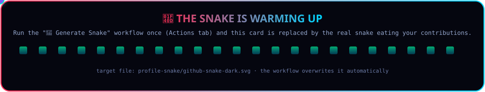
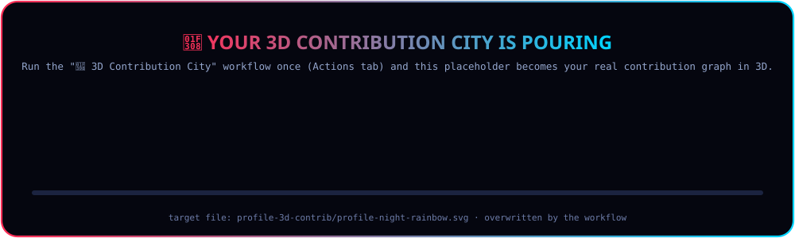

<!--
  ██╗     █████╗ ██╗   ██╗██╗██████╗  █████╗      ██╗
  ██║    ██╔══██╗██║   ██║██║██╔══██╗██╔══██╗     ██║
  ██║    ███████║██║   ██║██║██████╔╝███████║     ██║
  ██║    ██╔══██║╚██╗ ██╔╝██║██╔══██╗██╔══██║██   ██║
  ███████╗██║  ██║ ╚████╔╝ ██║██║  ██║██║  ██║╚█████╔╝
  ╚══════╝╚═╝  ╚═╝  ╚═══╝  ╚═╝╚═╝  ╚═╝╚═╝  ╚═╝ ╚════╝
  RGB animated profile README · Laviraj Jangid · EE 2nd year, Jaipur
  Everything below is plain markdown + animated SVG. No scripts, no tracking.
  HOW TO EDIT: search the file for the phrase "EDIT:" / those are the only
  lines you ever need to change (links, email, skill percentages, job titles).
-->

<div align="center">

<!-- ════════ ANIMATED RGB BANNER (power surge every 9s) ════════ -->


<br/>

<!-- ════════ TYPEWRITER TERMINAL (types one tagline at a time) ════════ -->


<br/><br/>

<!-- ════════ SCROLLING KEYWORD TAPE (infinite scroll + shine sweep) ════════ -->


<br/>

<a name="nav"></a>
**[⚡ About](#about) · [🔌 Circuit](#inside-my-breadboard) · [🧰 Stack](#tech-stack) · [📊 Stats](#github-stats) · [🎓 Beginner Vault](#beginner-vault) · [📬 Connect](#connect)**

<br/>



</div>

<a name="about"></a>

## About Me

<table>
<tr>
<td width="34%" align="center" valign="middle">

<!-- ════════ RGB MONOGRAM (radar pings + orbiting electrons) ════════ -->


</td>
<td width="66%" valign="top">

```python
# laviraj.py  ── run:  python -m me
class Laviraj:
    name      = "Laviraj Jangid"
    role      = "B.Tech Electrical Engineering · 2nd year"
    location  = "Jaipur, Rajasthan, India 🇮🇳"
    languages = ["C", "Python", "a little Embedded C"]
    learning  = ["Circuit design", "Robotics", "Automation"]
    experience= ["IoT projects", "Social media management"]
    mindset   = "simulate first, solder second, document always"

    def goal(self):
        return "design circuits that sense the world → automate it"
```

**Short version:** I'm an EE student who likes the moment when a schematic
finally blinks on a breadboard. I'm building my career path around
**circuits + electronics**, with **robotics & automation** as the direction
and **IoT** as the thing I already have hands-on experience in. I also run
social media, so I know how to *explain* a project, not just build it.

</td>
</tr>
</table>

<div align="center">

<!-- ════════ ANIMATED RGB SKILL BARS ════════ -->


</div>

<br/>

<a name="now"></a>

## Right Now

<div align="center">

| 🎯 Focus | 🛠️ Working with | 📚 Next 3 things |
|:--|:--|:--|
| Circuit design & electronics fundamentals | Breadboard, multimeter, Tinkercad, KiCad | Read an analog datasheet end-to-end |
| Robotics basics (sense → think → act) | Arduino UNO, ESP32, L298N, servos | Build a PID line follower |
| IoT with a purpose | ESP8266, MQTT, Blynk, ThingSpeak, Telegram bots | Log sensor data to a cloud dashboard |
| Being readable & hireable | Git, GitHub, Markdown, technical writing | Ship one documented project per month |

</div>

<div align="center">

> **Currently:** 2nd year, no shortcuts — building the base so the advanced stuff lands easy later. 🔋

</div>

<br/>

<a name="inside-my-breadboard"></a>

## Inside My Breadboard

<div align="center">

*Watch the signal travel — each block lights up in turn, and the dashes carry live current.* ⚡

<!-- ════════ AUTO-CYCLING CIRCUIT SVG (blocks light up in turn) ════════ -->


</div>

<br/>

<a name="tech-stack"></a>

## Tech Stack

<div align="center">

**Languages & core**


**Hardware & electronics**


**IoT, tools & the internet part**


<br/>


</div>

<br/>

<a name="github-stats"></a>

## GitHub Stats

<div align="center">

<!-- ════════ LIVE STATS CARDS (they update themselves) ════════ -->


<br/>


<br/>


<br/>


<br/><br/>

<!-- ════════ SNAKE EATS MY CONTRIBUTION GRAPH (auto-generated by Actions) ════════ -->

<!-- EDIT: light-theme reader? swap the line above to ./profile-snake/github-snake.svg -->

<br/>

<!-- ════════ 3D CONTRIBUTION CITY (auto-generated by Actions) ════════ -->


<br/>


<sub>Fresh account, honest numbers — they climb as the commits land. 📈 The snake + 3D city show animated placeholders until you run the two included GitHub Actions once; after that they are real.</sub>

</div>

<br/>

<a name="beginner-vault"></a>

## Beginner Vault 🎓

*The stuff I wish someone had handed me in 1st year: five basics that make you look
serious as an EE student, each learnable in a weekend, each with proof you can put on GitHub.*

<div align="center">

| # | Basic skill | Time to learn | Free place to learn it | Tiny proof-of-work project |
|:-:|:--|:--|:--|:--|
| 1 | **Git & GitHub** (clone, branch, commit, push, PR) | 1 evening | GitHub Skills *(github.com/skills)* | Push a repo with a `README.md` and 3 commits |
| 2 | **Markdown + badges** (tables, `<details>`, shields.io) | 1 hour | GitHub Docs → *Basic writing and formatting syntax* | Your own profile README like this one |
| 3 | **Simulate before you solder** | 1 weekend | **Tinkercad Circuits**, **Wokwi**, **Falstad** (all free, all in-browser) | Blink an LED + read a temperature sensor in simulation |
| 4 | **Electronics basics** (Ohm's law, voltage divider, pull-ups, LED resistor, DMM) | 1 week | All About Circuits – *DC volume* | Build a voltage divider, measure it, prove it with math |
| 5 | **Python ↔ hardware bridge** (pyserial + matplotlib) | 1 weekend | Arduino `Serial.println` docs + `pyserial` docs | Plot live sensor data on your laptop from an Arduino |

</div>

<details>
<summary><b>💡 6th skill nobody teaches: documenting your own project (click me)</b></summary>

<br/>

A project nobody can read is a project that doesn't exist. A 5-line README beats a
perfect circuit photo every single time:

```markdown
# Ultrasonic Parking Sensor
**What:** Buzzer speeds up as an object gets closer (HC-SR04 + Arduino UNO).
**Why:** Learning `pulseIn()` timing and thresholds.
**Parts:** Arduino UNO, HC-SR04, buzzer, 220Ω resistor, jumper wires.
**How to run:** open `sensor.ino` → upload → open Serial Monitor at 9600 baud.
**What broke:** buzzer was too loud; added `tone()` sweep + 10kΩ pot.
**Next:** add OLED display, then log distance to ThingSpeak.
```

That's it. `What / Why / Parts / How to run / What broke / Next`. Engineers hire on
clarity, marks come second.

</details>

<details>
<summary><b>🗓️ My 30-day starter plan (tick the boxes — they work in GitHub)</b></summary>

<br/>

**Week 1 — get dangerous with tools**

- [ ] Day 1–2: `git clone`, `git add`, `git commit`, `git push` on repeat until it's muscle memory
- [ ] Day 3: learn Markdown properly (headings, lists, code blocks, tables, `<details>`)
- [ ] Day 4: create the `lavirajjangid-rgb` repo and paste a profile README
- [ ] Day 5–7: blink an LED in Tinkercad, then for real, then change the blink rate with a pot

**Week 2 — make it sense**

- [ ] Read one sensor datasheet (DHT11 or HC-SR04) fully — pins, timing diagram, ranges
- [ ] Wire it, print readings on the Serial Monitor
- [ ] Write a function that converts raw readings into real units (°C / cm)
- [ ] Add a `Serial.println` log format you'd be happy to show someone

**Week 3 — make it talk (IoT)**

- [ ] Connect ESP8266/ESP32 to Wi-Fi and print the IP
- [ ] Send one reading to ThingSpeak or Blynk, watch it on your phone
- [ ] Add a simple alert (Telegram bot message when the value crosses a limit)
- [ ] Commit the code with a real README, not `final_final2.ino`

**Week 4 — make it move (robotics)**

- [ ] Drive one DC motor with an L298N, then two (forward / back / turn)
- [ ] Add IR sensors and write the line-follower logic from scratch
- [ ] Tune it — this is where you actually learn control
- [ ] Publish the build log with photos/gifs and a wiring diagram

</details>

<details>
<summary><b>🧩 Steal my snippets: add the same animations to your README in 5 minutes</b></summary>

<br/>

**1. Self-typing line** (no code, no build step — the service renders it for you)

```markdown

```

**2. The animation I actually prefer: your own SVG file** → drop it in `assets/`, then ``.
Animated SVG works on GitHub because it's an *image*, not HTML — so CSS `@keyframes`
and SVG `<animate>` run inside it, with no JavaScript allowed anywhere. Minimal example you can copy today:

```svg
<svg xmlns="http://www.w3.org/2000/svg" width="520" height="90" viewBox="0 0 520 90">
  <defs>
    <linearGradient id="g" x1="0%" y1="0%" x2="100%" y2="0%">
      <stop offset="0%" stop-color="#ff2d55">
        <animate attributeName="stop-color" dur="6s" repeatCount="indefinite"
                 values="#ff2d55;#00ff9d;#00d4ff;#b026ff;#ff2d55"/>
      </stop>
      <stop offset="100%" stop-color="#00d4ff"/>
    </linearGradient>
  </defs>
  <style>
    #b { animation: breathe 3s ease-in-out infinite; }
    @keyframes breathe { 0%,100% { transform: scale(1) } 50% { transform: scale(1.04) } }
    /* NOTE: :hover never fires inside an  on GitHub. Timers, not hover. */
  </style>
  <rect x="2" y="2" width="516" height="86" rx="16" fill="#05060f" stroke="url(#g)" stroke-width="2"/>
  <g id="b" transform-origin="260 45">
    <text id="t" x="260" y="56" text-anchor="middle" font-family="monospace"
          font-size="30" fill="url(#g)">HELLO, WORLD</text>
  </g>
</svg>
```

**3. Badges** — `https://img.shields.io/badge/TEXT-COLOR?style=for-the-badge&logo=LOGO&logoColor=white`
*(find `LOGO` names at simpleicons.org)*

**4. Stats / streak / trophies** — swap `USERNAME` in these and paste:

```markdown


```

**5. Collapsible section** (great for long build logs)

```markdown
<details>
<summary><b>Click to expand</b></summary>
Hidden content goes here.
</details>
```

**6. What GitHub silently deletes** (so you don't lose an evening like I did): `<script>`,
`<iframe>`, `<marquee>`, `<picture>`, `<source>` and inline `style="..."` CSS are all removed by
the README sanitiser. The allow-list is basically *headings, p, div, img, a, table, details, summary,
code, sub/sup, b/i/strong/em, br, hr, kbd*. Anything fancier has to live **inside your SVG file** —
that is the whole trick behind this page.

</details>

<details>
<summary><b>🔧 Hardware truth bombs (save yourself the tears)</b></summary>

<br/>

- An LED ***always*** needs a resistor. 220Ω–330Ω for 5V. No exceptions, no luck.
- A breadboard's power rails are **not** connected across the middle — bridge them.
- ESP32/ESP8266 pins are **3.3V logic**. Feed 5V into one and you buy a new board.
- Motors and relays need a **driver** (L298N / transistor) *and* a flyback diode — never straight off a GPIO.
- If it doesn't work: measure voltages first, then re-seat every jumper, *then* look at the code.
- `delay()` stops everything. Learn `millis()` and your robot stops stuttering.
- Label your wires/sensors in photos. Future-you is a stranger with no memory.

</details>

<br/>

<a name="connect"></a>

## Connect

<div align="center">

<!-- EDIT: replace the three placeholder links below with your real profiles -->
[](mailto:lavirajjangid@gmail.com)
[](#)
[](#)
[](https://github.com/lavirajjangid-rgb)

**Open to:** internships, robotics/IoT club projects, hardware collabs, and any
sensor that refuses to cooperate. 🛠️

<sub>⚡ Fun fact: the fastest way to learn electronics is to break something cheap on purpose.</sub>

<br/><br/>

<!-- ════════ ANIMATED WAVE FOOTER (travelling surge spark) ════════ -->


<br/><br/>

*Readme crafted with circuits, caffeine and zero JavaScript.*

</div>

<!-- ════════════════════════════════════════════════════════════════════
     HOW THIS README WORKS (delete this comment if you like)
     · assets/*.svg  -> my own animated SVGs: CSS @keyframes + SVG <animate>,
                       all on timers. GitHub shows them as plain images and the
                       browser animates them. No JS and no hover needed, because
                       :hover never fires inside an  on GitHub.
     · Live cards    -> github-readme-stats / streak-stats / trophy / activity-graph
                       pull real numbers from your account.
     · snake + 3D    -> .github/workflows/*.yml regenerate those two images
                       every night. Run them twice from the Actions tab.
     · All editable spots are marked with EDIT: in the file.
     ════════════════════════════════════════════════════════════════════ -->
